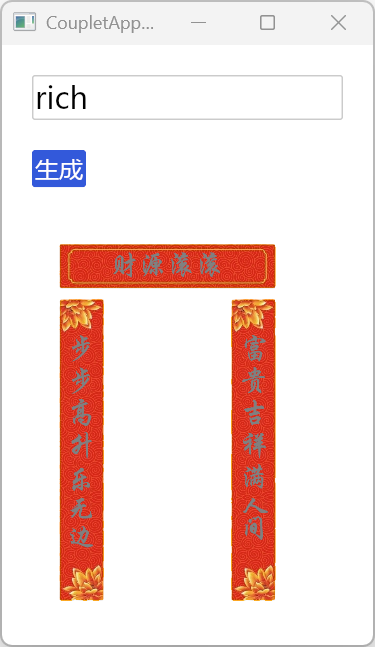

# 🎴 couplet_gen - AI 对联生成器  

**couplet_gen** 是一个用 Rust 编写的智能对联生成器，利用 AI（如 GPT 和 deepseek）结合传统文化，自动生成优美的中文对联。  

<p align="center">
  
</p>

## 🏆 项目简介  

🔹 **文化传承**：自动生成符合传统对仗规则的对联 🎨  
🔹 **高效性能**：Rust 语言编写，运行快速稳定 🚀  
🔹 **AI 驱动**：基于 GPT、deepseek 等技术进行自然语言生成 🤖  
🔹 **可视化展示**：支持将生成的对联渲染为图片，增强美观度 🖼️  
🔹 **开源可扩展**：代码结构清晰，便于开发者二次开发 👨‍💻  

## 🎯 功能特性  

✅ 生成合适的 **上联、下联**，符合对仗规律  
✅ 结合 AI 算法，提高对联的 **流畅性和创意性**  
✅ **Rust 代码实现**，提供高效的文本处理能力  
✅ 未来可拓展 **语音输入、手写输入** 等交互方式  

---

## 🚀 快速开始  

### 📌 环境要求  

- **Rust 1.x** 或更高版本（[Rust 安装指南](https://www.rust-lang.org/)）  
- **Cargo**（Rust 包管理工具）  

### 📥 安装步骤  

```bash
# 1️⃣ 克隆仓库
git clone https://github.com/pwh-pwh/couplet_gen.git
cd couplet_gen

# 2️⃣ 构建项目
cargo build --release

# 3️⃣ 运行项目
cargo run --release
```

---

## 🗂️ 项目结构  

```
📂 couplet_gen
 ├── 📜 Cargo.toml      # Rust 项目配置文件
 ├── 📂 src             # 主要源码目录
 ├── 📂 img             # 存放示例图片
 ├── 🖼️ r1.png         # 生成的示例对联
 ├── 🏗️ README.md      # 项目说明文档
 └── 📜 LICENSE         # 许可证文件
```

---

## 📌 使用指南  

1. **运行项目**，输入上联，程序会自动生成下联  
2. **修改模型参数**，自定义对联风格  
3. **可视化生成**，自动输出图片格式对联  
4. **扩展与优化**，可接入更多 AI 模型，提高生成质量  

---


---

## 🎯 未来计划  

- [ ] **支持多种风格**（古典、现代、文言、白话）  
- [ ] **提供 API**，供外部应用调用  
- [ ] **集成 UI 界面**，可视化输入输出  

---

## 🤝 贡献指南  

🎯 **欢迎贡献代码！**  

💡 如果你对本项目感兴趣，可以通过以下方式参与贡献：  

1. 提交 **Issues** 提出建议或 Bug 反馈  
2. 提交 **Pull Request** 贡献新功能或优化代码  
3. Star ⭐ 支持项目，分享给更多朋友  

---

## 📜 许可证  

本项目采用 **MIT 许可证** 进行开源。详情请查看 [LICENSE](LICENSE) 文件。  

---

## 📞 联系方式  

📧 如有任何问题或建议，请在 [GitHub Issues](https://github.com/pwh-pwh/couplet_gen/issues) 进行反馈！    

🔗 **项目地址**：[GitHub - couplet_gen](https://github.com/pwh-pwh/couplet_gen)  
